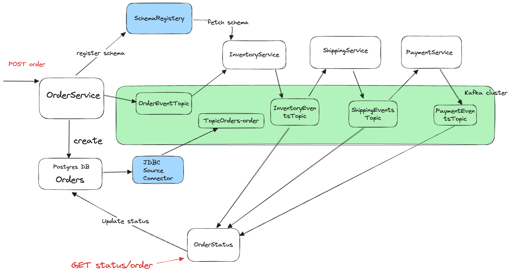

# Order System

This project aims to showcase an Event-Driven Architecture (EDA) design for an order processing system using Go and Kafka. Specifically, it aims to provide a working example that demonstrates the following in a local environment from scratch.

- How to implement basic `producer` and `consumer`
- How to use `schema registry`
- How to use `connector`

It looks like this in high level.




## Getting Started

### Prerequisites
- Docker
- Docker Compose
- Go

### Start the infra

Run `docker-compose up` to start all the necessary infrastructure (Kafka, Postgres, Schema Registry, Connector).

### Build and Run Services

Run the following services in separate tmux panels.

1. **OrderService**:
```
   go run *.go
```

2. **InventoryService**:
```
   go run inventory.go
```

3. **ShippingService**:
```
   go run shipping.go
```

4. **PaymentService**:
```
   go run payment.go
```

5. **OrderStatusService**:

   The `OrderStatusService` is integrated into the `OrderService` and runs as part of it.

### Create an Order

To create an order, send a POST request to the `/order` endpoint:

```
curl -X POST -H "Content-Type: application/json" -d '{"userId":"123","items":["item1","item2"]}' http://localhost:8080/order
```

### Check Order Status

To check the status of an order, send a GET request to the `/order/status` endpoint with the `orderId`:

```
curl -X GET "http://localhost:8080/order/status?orderId=<orderId>"
```

Replace `<orderId>` with the actual order ID returned from the POST request.


## Appendix  - Simple producer and consumer

### producer and consumer - programmtically

```bash
cd producer
go run producer.go
```

```bash
cd consumer
go run consumer.go
```

### producer and consumer - command

you can add "docker exec -it <kafka_container_id> " to all following command; following command expect you are inside of the conatainer by `docker exec -it <kafka_container_id> bash`.

#### creat topics

```
kafka-topics.sh --create --topic test_topic --zookeeper zookeeper:2181 --partitions 1 --replication-factor 1
```

#### list topics

```
kafka-topics.sh --list --zookeeper zookeeper:2181 localhost:9092
```

#### produce and consume messager

```
kafka-console-producer.sh --topic test_topic --broker-list localhost:9092
```

```
kafka-console-consumer.sh --topic test_topic --bootstrap-server localhost:9092 --from-beginning
```

## Services and Queues

### Services
1. **OrderService**: Handles order creation and publishes order events.
2. **InventoryService**: Consumes order events, checks inventory, and publishes inventory events.
3. **ShippingService**: Consumes inventory events and publishes shipping events.
4. **PaymentService**: Consumes shipping events, processes payments, and publishes payment events.
5. **OrderStatusService**: Consumes all relevant events and maintains the current status of each order.

### Queues (Kafka Topics)
1. **OrderEventsTopic**: Where order events are published.
2. **InventoryEventsTopic**: Where inventory events are published.
3. **ShippingEventsTopic**: Where shipping events are published.
4. **PaymentEventsTopic**: Where payment events are published.
